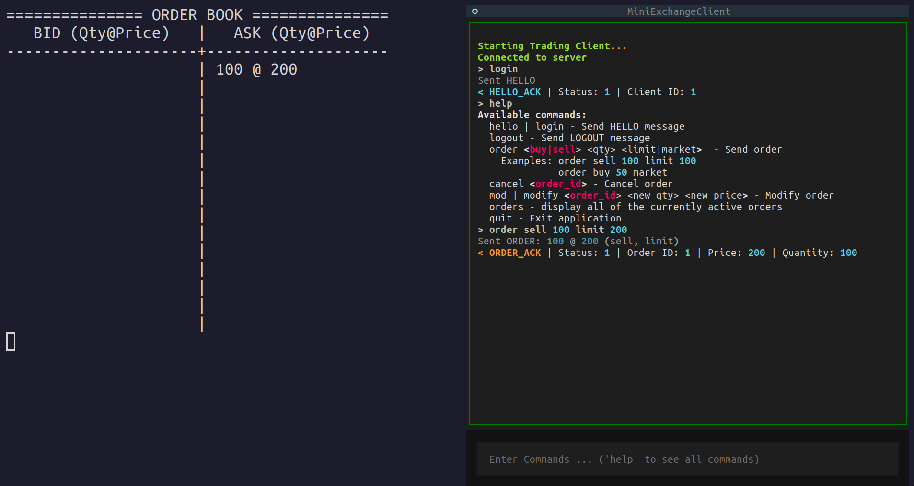

# MiniExchange

A simulated financial exchange system, with local network support, written in C++. Supports order submission, cancellation and modification through custom binary message protocol [(*specs*)](docs/MiniExchange-wire-spec.md).

Includes high-precision & low-overhead timing instrumentation, Python analysis module available for latency analysis.

Linux support only.

## Usage Overview

There are a few different parts of the system, the main one being the server component, called "MiniExchange". This is the main binary, there is also a client runner binary available, called "ClientRunner", this program connects a configured amount of clients and sends requests, good for load testing.

For a user interface, use the Python terminal user interface client, found in `scripts/pyClient.py`

## Building & Configuring the Application

To get help with building, consider checking out [build help.](docs/build-help.md)

Use either cmake manually (not recommended) or run the helper script to help configure correctly. The script can select the build type, compiler flags, and writes some config metadata later used in the configuration process and writes it to `config/build_config.json`.

Run (from project root):
```bash
python3 scripts/build_helper.py -i
```

>[!NOTE]
>Use the `-i` flag for **Interactive** mode, which will promt the user for which options to set at each step with sensible defaults. Omitting the flag will use the defaults.

After this step, a corresponding build directory will appear, like `build-release` (name depends on build type).

To check if everything has worked run the tests:

```bash
ctest --test-dir build-release # replace "release" if using another build type
```

Before running the exchange, configure with a configuration script, again, use the `-i` flag for interactive mode:

```bash
python3 scripts/configure.py -i
```
1. First, enter a build-type or accept the default. The script will look in the build configuration and use the type found there for the default.
2. Select the port that the exchange should use (use default unless the source changed)
3. Give a name to the run, which will be used to find the log files in the output folder, the default will give it a timestamped name, like `run-yyyymmdd-hhmmss-xxxx`, the last 4 letters being randomly generated. Otherwise give the run any name.
4. Configuration done, the choices are saved to `config/server_run_cfg.json`.

After these steps the application is ready to be run.

```bash
./build-release/MiniExchange
```
It will read the run configuration, enrich it with runtime information, then set up the server. Based on the selected logging information it will start writing to the run's directory.

To connect and submit the first limit order in a **new terminal**, run (while the exchange is running):

```bash
python3 scripts/pyClient.py
```

This will launch the terminal user interface. Type `help` and press enter to display all of the available commands.

All clients that connect to the exchange have to be authenticated to start trading. A complete auth system is not implemented, so all a client needs to do currently is send a `HELLO` message. New order requests sent before the first `HELLO` will be sent but ignored by the server.

To send a request, type the command into the promt area at the bottom of the terminal interface and press Enter to send.

To send the first order:

```
> hello # or "login"
Sent HELLO
< HELLO_ACK | Status: 1 | ClientID: 2 
> order sell 100 limit 200 # place a limit order for 100 units at price 200
Send ORDER: 100 @ 200 (sell, limit)
```

At this point the order should appear on the order book of (in the terminal that the exchange is running on)

### Screenshot of the output at this point



> [!NOTE]
> Self trading is disallowed, no orders placed by the same clients will match with themselves

Launch a new terminal and a new client to try out placing an opposite limit order (same price and quantity) and watch them get matched, and the trade notifications being sent to both parties.

## Requirements
Requires: 
- cmake
- a Python package manager (textual, numpy, pandas, matplotlib)
- Pybind11
- gcc/clang (only tested with gcc 13.0)
- g++ 13.0+
- GoogleTest

> [!NOTE]
> The Python prototype of this project has been moved to branch `legacy`

